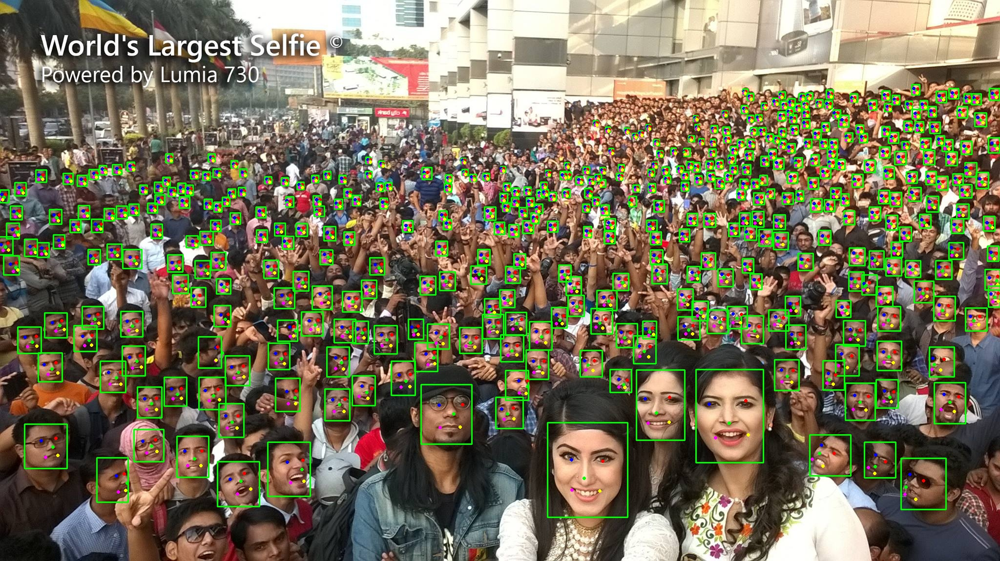

# YuNet

YuNet is a light-weight, fast and accurate face detection model, which achieves 0.834(AP_easy), 0.824(AP_medium), 0.708(AP_hard) on the WIDER Face validation set.

Notes:

- Model source: [here](https://github.com/ShiqiYu/libfacedetection.train/blob/a61a428929148171b488f024b5d6774f93cdbc13/tasks/task1/onnx/yunet.onnx).
- This model can detect **faces of pixels between around 10x10 to 300x300** due to the training scheme.
- For details on training this model, please visit https://github.com/ShiqiYu/libfacedetection.train.
- This ONNX model has fixed input shape, but OpenCV DNN infers on the exact shape of input image. See https://github.com/opencv/opencv_zoo/issues/44 for more information.
- `face_detection_yunet_2023mar_int8bq.onnx` represents the block-quantized version in int8 precision and is generated using [block_quantize.py](../../tools/quantize/block_quantize.py) with `block_size=64`.
- Paper source: [Yunet: A tiny millisecond-level face detector](https://link.springer.com/article/10.1007/s11633-023-1423-y).

Results of accuracy evaluation with [tools/eval](../../tools/eval).

| Models      | Easy AP | Medium AP | Hard AP |
| ----------- | ------- | --------- | ------- |
| YuNet       | 0.8844  | 0.8656    | 0.7503  |
| YuNet block | 0.8845  | 0.8652    | 0.7504  |
| YuNet quant | 0.8810  | 0.8629    | 0.7503  |


\*: 'quant' stands for 'quantized'.
\*\*: 'block' stands for 'blockwise quantized'.


## Demo

### Python

Run the following command to try the demo:

```shell
# detect on camera input
python demo.py
# detect on an image
python demo.py --input /path/to/image -v

# get help regarding various parameters
python demo.py --help
```

### C++

Install latest OpenCV and CMake >= 3.24.0 to get started with:

```shell
# A typical and default installation path of OpenCV is /usr/local
cmake -B build -D OPENCV_INSTALLATION_PATH=/path/to/opencv/installation .
cmake --build build

# detect on camera input
./build/demo
# detect on an image
./build/demo -i=/path/to/image -v
# get help messages
./build/demo -h
```

### Example outputs




## License

All files in this directory are licensed under [MIT License](./LICENSE).

## Reference

- https://github.com/ShiqiYu/libfacedetection
- https://github.com/ShiqiYu/libfacedetection.train

## Citation

If you use `YuNet` in your work, please use the following BibTeX entries:

```
@article{wu2023yunet,
  title={Yunet: A tiny millisecond-level face detector},
  author={Wu, Wei and Peng, Hanyang and Yu, Shiqi},
  journal={Machine Intelligence Research},
  volume={20},
  number={5},
  pages={656--665},
  year={2023},
  publisher={Springer}
}
```
